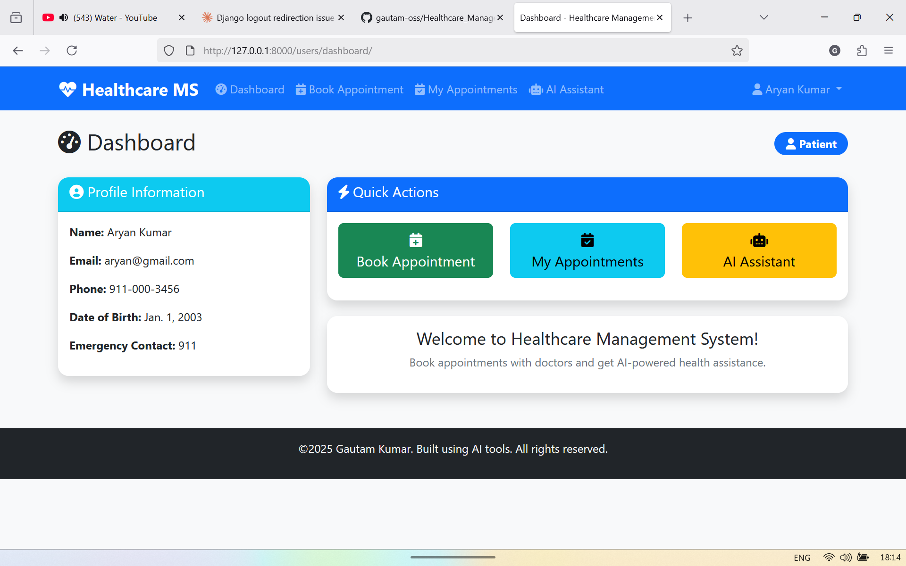
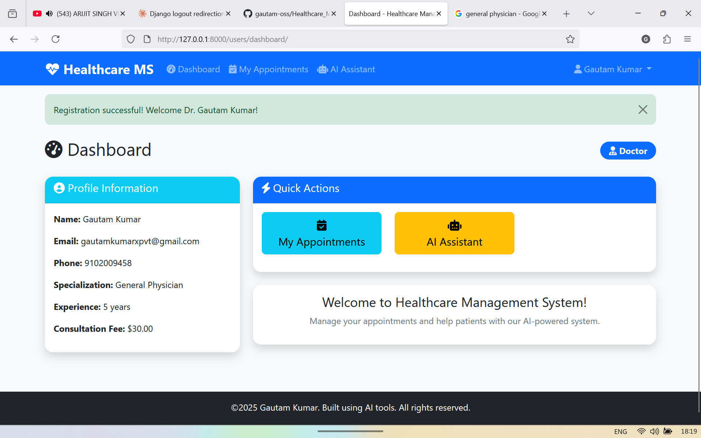
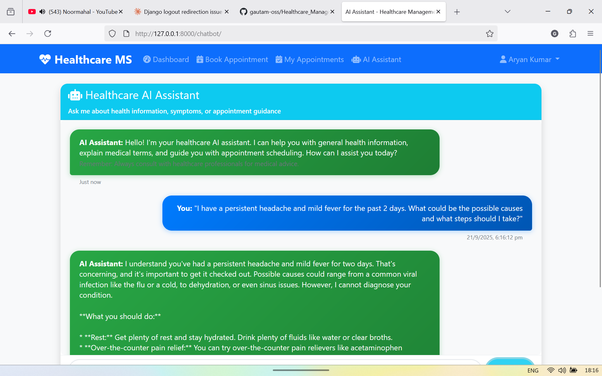
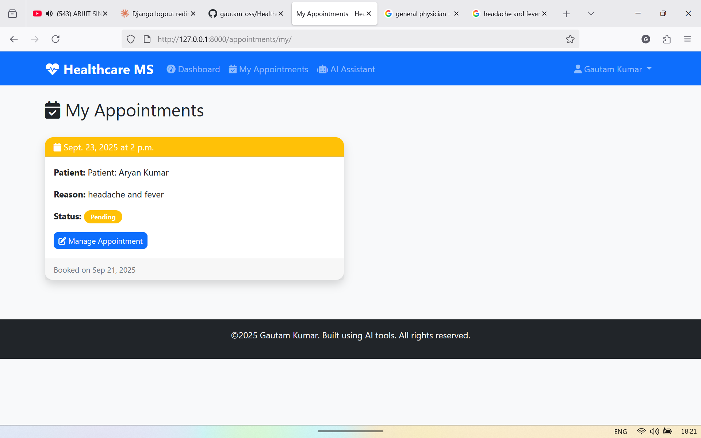

# 🏥 Healthcare Management System

A comprehensive full-stack healthcare platform that connects patients and doctors, featuring appointment booking, AI-powered health assistance, and streamlined healthcare management. Built with Django and powered by Google's Gemini AI.


## 📱 Screenshots

### Patient Dashboard


### Doctor Interface


### AI Chat Interface


### Appointment Booking


## ✨ Features

### 👥 **User Management**
- **Dual User Types**: Separate registration and dashboards for patients and doctors
- **Secure Authentication**: Django's built-in authentication with custom user model
- **Profile Management**: Comprehensive profiles with medical information

### 📅 **Appointment System**
- **Easy Booking**: Patients can book appointments with available doctors
- **Real-time Status Updates**: Track appointment status (Pending, Confirmed, Completed, Cancelled)
- **Doctor Management**: Doctors can manage and update appointment statuses
- **Appointment History**: Complete history with timestamps and notes

### 🤖 **AI-Powered Health Assistant**
- **Gemini AI Integration**: Advanced conversational AI for health guidance
- **Health Information**: Get reliable medical information and explanations
- **Symptom Guidance**: AI assistance for understanding symptoms (not a replacement for medical advice)
- **Conversation History**: Persistent chat history for continued conversations

### 🎨 **Modern UI/UX**
- **Responsive Design**: Bootstrap 5 for mobile-first design
- **Interactive Elements**: Real-time chat interface with typing indicators
- **Professional Healthcare Theme**: Clean, medical-focused design
- **Accessibility**: WCAG compliant interface elements

## 🛠 Tech Stack

### **Backend**
- **Django 5.2.6**: Web framework
- **PostgreSQL**: Primary database
- **Google Gemini AI**: Conversational AI service
- **Django REST Framework**: API development (ready for extension)

### **Frontend**
- **HTML5/CSS3**: Structure and styling
- **Bootstrap 5**: Responsive UI framework
- **JavaScript (ES6+)**: Interactive functionality
- **Font Awesome**: Icon library

### **DevOps & Deployment**
- **Docker & Docker Compose**: Containerization
- **Gunicorn**: WSGI HTTP Server
- **Nginx**: Reverse proxy and static file serving
- **PostgreSQL**: Production database

### **Development Tools**
- **python-decouple**: Environment variable management
- **Django Debug Toolbar**: Development debugging (optional)
- **Whitenoise**: Static file serving

## 📁 Project Structure

```
Healthcare_Management_System/
├── Healthcare_Management_System/     # Main project configuration
│   ├── __init__.py
│   ├── settings.py                   # Django settings
│   ├── urls.py                       # Main URL configuration
│   ├── wsgi.py                       # WSGI configuration
│   └── asgi.py                       # ASGI configuration
├── users/                            # User management app
│   ├── models.py                     # User, Patient, Doctor models
│   ├── views.py                      # Authentication views
│   ├── forms.py                      # Registration forms
│   ├── admin.py                      # Admin configuration
│   └── templates/users/              # User templates
├── appointments/                     # Appointment management app
│   ├── models.py                     # Appointment model
│   ├── views.py                      # Appointment CRUD views
│   ├── forms.py                      # Appointment forms
│   └── templates/appointments/       # Appointment templates
├── chatbot/                          # AI chatbot app
│   ├── models.py                     # Conversation & Message models
│   ├── views.py                      # Chat API views
│   ├── services.py                   # Gemini AI integration
│   └── templates/chatbot/            # Chat interface
├── static/                           # Static files
│   ├── css/
│   └── js/
├── templates/                        # Global templates
│   ├── base.html                     # Base template
│   └── navbar.html                   # Navigation component
├── requirements.txt                  # Python dependencies
├── manage.py                         # Django management script
├── Dockerfile                        # Docker configuration
├── docker-compose.yml               # Docker Compose setup
└── README.md                         # This file
```

## 🚀 Installation & Setup

### Prerequisites
- Python 3.11+ 
- PostgreSQL 15+
- Docker & Docker Compose (for containerized deployment)
- Git

### Local Development

1. **Clone the repository**
   ```bash
   git clone https://github.com/yourusername/Healthcare-Management-System.git
   cd Healthcare-Management-System
   ```

2. **Create virtual environment**
   ```bash
   python -m venv venv
   source venv/bin/activate  # On Windows: venv\Scripts\activate
   ```

3. **Install dependencies**
   ```bash
   pip install -r requirements.txt
   ```

4. **Environment setup**
   ```bash
   cp .env.example .env
   # Edit .env with your configuration
   ```

5. **Database setup**
   ```bash
   # Create PostgreSQL database
   createdb healthcare_db
   
   # Run migrations
   python manage.py makemigrations
   python manage.py migrate
   ```

6. **Create superuser**
   ```bash
   python manage.py createsuperuser
   ```

7. **Run development server**
   ```bash
   python manage.py runserver
   ```

   Visit: `http://localhost:8000`

### Docker Deployment

1. **Clone and navigate to project**
   ```bash
   git clone https://github.com/yourusername/Healthcare-Management-System.git
   cd Healthcare-Management-System
   ```

2. **Create production environment file**
   ```bash
   cp .env.example .env.production
   # Edit .env.production with production values
   ```

3. **Build and run with Docker Compose**
   ```bash
   # Development
   docker-compose up --build
   
   # Production
   docker-compose -f docker-compose.prod.yml up --build -d
   ```

4. **Run migrations in container**
   ```bash
   docker-compose exec web python manage.py migrate
   docker-compose exec web python manage.py createsuperuser
   ```

5. **Access the application**
   - Application: `http://localhost:8000`
   - Admin Panel: `http://localhost:8000/admin`

## ⚙️ Configuration

### Environment Variables (.env)

```bash
# Django Configuration
SECRET_KEY=your_secret_key_here
DEBUG=True
ALLOWED_HOSTS=localhost,127.0.0.1

# Database Configuration  
DB_NAME=healthcare_db
DB_USER=your_db_user
DB_PASSWORD=your_db_password
DB_HOST=localhost
DB_PORT=5432

# AI Configuration
GEMINI_API_KEY=your_gemini_api_key_here

# Security Settings (Production)
SECURE_SSL_REDIRECT=False
CSRF_COOKIE_SECURE=False
SESSION_COOKIE_SECURE=False
```

### Gemini API Setup

1. Visit [Google AI Studio](https://makersuite.google.com/app/apikey)
2. Create a new API key
3. Add the API key to your `.env` file as `GEMINI_API_KEY`

### Production Settings

For production deployment, ensure:
- `DEBUG=False`
- Configure `ALLOWED_HOSTS` with your domain
- Use HTTPS and enable security headers
- Set up proper database backups
- Configure logging and monitoring

## 🎯 Usage

### For Patients

1. **Register**: Create a patient account with personal and medical information
2. **Login**: Access your personalized dashboard
3. **Book Appointments**: 
   - Browse available doctors
   - Select preferred date and time
   - Provide reason for visit
4. **AI Health Assistant**: 
   - Ask health-related questions
   - Get symptom guidance
   - Receive medication information
5. **Manage Appointments**: View and track appointment status

### For Doctors

1. **Register**: Create a doctor account with professional credentials
2. **Login**: Access doctor dashboard with patient management tools
3. **Manage Appointments**:
   - View incoming appointment requests
   - Confirm or reschedule appointments
   - Add clinical notes
   - Update appointment status
4. **AI Assistant**: Use AI for patient education and information

### Admin Features

- User management (patients and doctors)
- Appointment oversight and management
- System configuration and monitoring
- AI conversation logs and analytics


## 🔧 API Documentation

### Authentication Endpoints
- `POST /users/login/` - User login
- `POST /users/logout/` - User logout
- `POST /users/register/patient/` - Patient registration
- `POST /users/register/doctor/` - Doctor registration

### Appointment Endpoints
- `GET /appointments/my/` - List user appointments
- `POST /appointments/book/` - Create new appointment
- `PUT /appointments/update/{id}/` - Update appointment (doctors only)

### Chatbot Endpoints
- `GET /chatbot/` - Chat interface
- `POST /chatbot/send/` - Send message to AI

## 🧪 Testing

Run the test suite:
```bash
# Run all tests
python manage.py test

# Run specific app tests
python manage.py test users
python manage.py test appointments
python manage.py test chatbot

# Run with coverage
coverage run --source='.' manage.py test
coverage report
```

## 🔒 Security Features

- **CSRF Protection**: Django's built-in CSRF middleware
- **XSS Prevention**: Template auto-escaping and security headers
- **SQL Injection Prevention**: Django ORM parameterized queries
- **Secure Password Hashing**: Django's PBKDF2 algorithm
- **Session Security**: Secure session management
- **Input Validation**: Form validation and sanitization

## 📈 Performance Optimization

- **Database Indexing**: Optimized database queries
- **Static File Compression**: Gzip compression for static files
- **Caching**: Redis caching for frequently accessed data (ready for implementation)
- **Database Connection Pooling**: Persistent database connections

## 🚀 Deployment Options

### 1. Traditional VPS/Server
- Use Gunicorn + Nginx
- PostgreSQL database
- SSL/TLS configuration

### 2. Docker Containerization
- Multi-stage Docker builds
- Docker Compose for orchestration
- Environment-based configuration

### 3. Cloud Platforms
- **Heroku**: Ready for Heroku deployment
- **AWS**: ECS/EKS compatible
- **Google Cloud**: Cloud Run ready
- **DigitalOcean**: App Platform compatible

## 🛡️ Production Checklist

Before deploying to production:

- [ ] Set `DEBUG=False`
- [ ] Configure `ALLOWED_HOSTS`
- [ ] Use environment variables for secrets
- [ ] Set up HTTPS/SSL
- [ ] Configure database backups
- [ ] Set up monitoring and logging
- [ ] Run security checklist: `python manage.py check --deploy`
- [ ] Configure error tracking (Sentry recommended)
- [ ] Set up CI/CD pipeline
- [ ] Performance testing completed

## 🤝 Contributing

We welcome contributions! Please follow these steps:

1. Fork the repository
2. Create a feature branch (`git checkout -b feature/AmazingFeature`)
3. Commit your changes (`git commit -m 'Add some AmazingFeature'`)
4. Push to the branch (`git push origin feature/AmazingFeature`)
5. Open a Pull Request

### Development Guidelines

- Follow PEP 8 style guide
- Write comprehensive tests
- Update documentation
- Use meaningful commit messages

## 🐛 Issue Reporting

Found a bug? Please report it:

1. Check existing issues first
2. Create a new issue with:
   - Clear description
   - Steps to reproduce
   - Expected vs actual behavior
   - System information

## 📞 Support

For support and questions:
- **Documentation**: Check this README first
- **Issues**: [GitHub Issues](https://github.com/yourusername/Healthcare-Management-System/issues)
- **Email**: your-email@example.com

## 🗺️ Roadmap

### Upcoming Features
- [ ] **Mobile App**: React Native mobile application
- [ ] **Video Consultations**: Integrated video calling
- [ ] **Payment Integration**: Stripe/PayPal payment processing
- [ ] **Electronic Health Records**: Complete EHR system
- [ ] **Prescription Management**: Digital prescription system
- [ ] **Multi-language Support**: Internationalization
- [ ] **Advanced Analytics**: Healthcare analytics dashboard
- [ ] **API v2**: RESTful API for third-party integrations

### Future Enhancements
- Machine Learning diagnosis assistance
- Wearable device integration
- Telemedicine platform expansion
- Healthcare data analytics
- Insurance integration

## 📄 License

This project is licensed under the MIT License - see the [LICENSE](LICENSE) file for details.

```
MIT License

Copyright (c) 2025 Gautam Kumar

Permission is hereby granted, free of charge, to any person obtaining a copy
of this software and associated documentation files (the "Software"), to deal
in the Software without restriction, including without limitation the rights
to use, copy, modify, merge, publish, distribute, sublicense, and/or sell
copies of the Software...
```

## 🙏 Acknowledgments

- **Django Community**: For the excellent web framework
- **Google AI**: For Gemini AI API access
- **Bootstrap Team**: For the responsive UI framework
- **PostgreSQL**: For the robust database system
- **Font Awesome**: For the beautiful icons

---

## 💡 Quick Start Commands

```bash
# Clone and setup
git clone https://github.com/yourusername/Healthcare-Management-System.git
cd Healthcare-Management-System
python -m venv venv
source venv/bin/activate
pip install -r requirements.txt
cp .env.example .env

# Database setup
python manage.py makemigrations
python manage.py migrate
python manage.py createsuperuser

# Run development server
python manage.py runserver

# Or with Docker
docker-compose up --build
```

**🎉 You're ready to revolutionize healthcare management!**

---

<p align="center">
  Made with ❤️ by <a href="https://github.com/yourusername">Gautam Kumar</a>
</p>

<p align="center">
  <a href="#top">⬆️ Back to Top</a>
</p>
